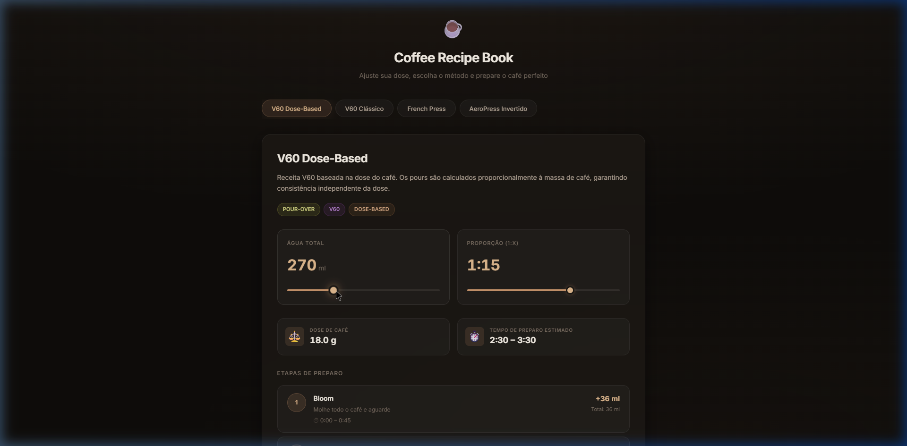

<div align="center">
  

  <h1>☕ Coffee Recipe Book</h1>
  <p><strong>Ajuste sua dose, escolha o método e prepare o café perfeito.</strong></p>
  
  [](https://reactjs.org/)
  [](https://vitejs.dev/)
</div>

<br />

## 📖 Sobre o Projeto

O **Coffee Recipe Book** é uma aplicação frontend minimalista desenvolvida para entusiastas de cafés especiais. A ferramenta permite não só consultar receitas consolidadas, mas também **ajustar dinamicamente** as proporções e volumes de água, recalculando instantaneamente os parâmetros de extração para diferentes métodos.

Seja você um fã de um *Pour-Over* técnico, uma *French Press* encorpada ou um *AeroPress* rápido, o app ajuda a padronizar a sua extração com base nos grãos que você tem em mãos.

## ✨ Principais Funcionalidades

- **🧮 Recálculo Dinâmico**: Informe o volume de **Água Total (ml)** ou a **Proporção (1:X)**. O app calcula matematicamente a dose exata de café (g) e os mililitros para cada etapa do preparo (Bloom, Pours 1/2/3).
- **📝 Fórmulas Baseadas em Dose**: Suporte nativo para receitas técnicas (como o **V60 Dose-Based**) onde os despejos de água são etapas fixas calculadas como múltiplos da massa de café (ex: $T_1 = 7.5C$).
- **📚 Catálogo de Métodos**: 
  - *V60 Dose-Based* (Precisão técnica)
  - *V60 Clássico* (Divisão simples em 3 pours)
  - *French Press* (Imersão total de 4 minutos)
  - *AeroPress Invertido* (Extração concentrada)
- **🎨 Design System Premium**: Interface _Dark Mode_ inspirada nas tonalidades do café (marrom e dourado crú), utilizando efeito de *Glassmorphism* para destacar os cards de receita. Totalmente responsivo e pensado _mobile-first_.

## 🚀 Como Executar Localmente

### Pré-requisitos
- Node.js (v18+)
- NPM ou Yarn

### Instalação

1. Clone o repositório ou navegue até o diretório do projeto:
```bash
git clone https://github.com/guijasss/coffee-recipebook.git
cd coffee-recipebook
```

2. Instale as dependências:
```bash
npm install
```

3. Inicie o servidor de desenvolvimento:
```bash
npm run dev
```

4. Acesse `http://localhost:5173` no seu navegador.

## 🛠️ Arquitetura e Tecnologias

- **React Engine**: Componentes funcionais e Hooks (`useState`, `useMemo` para recálculos performáticos).
- **Vite (Bundler)**: Scaffolding super-rápido, Hot Module Replacement instantâneo.
- **Vanilla CSS**: Estilização "zero dependencies" utilizando *CSS Variables* globais no `index.css`. Controles de design consistentes e fáceis de adaptar.
- **Data Layer (Sem backend)**: Receitas configuradas estaticamente em `src/data/recipes.js`. Funções puras garantem a atualização da interface em tempo real baseado nos inputs do usuário.

---
<div align="center">
  <p>Feito com ❤️ (e muito café)</p>
</div>
